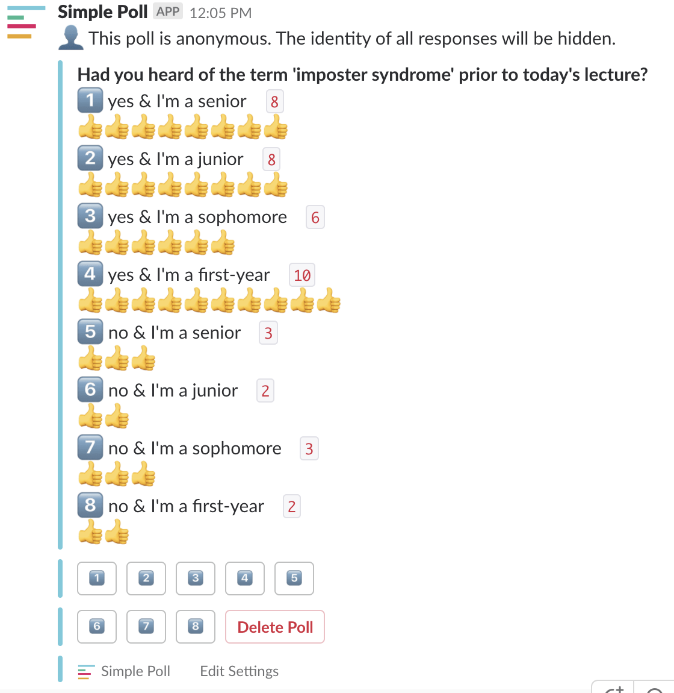

***

# Problem set 5 {#PS05}

*Assigned Wednesday 10/10, due Monday 10/15 at 9pm Eastern Time*

## 1. DataCamp

From DataCamp's [Working with Data in the Tidyverse](https://www.datacamp.com/courses/working-with-data-in-the-tidyverse){target="_blank"}:

* Chapter 1: "Explore your data"
    + Read the following [Google Form](https://docs.google.com/forms/d/e/1FAIpQLSewLIbRfpGK6J_XtDr4TrgJWP3G8fnkVYh22X0FJz1dOkGYjQ/viewform){target="_blank"} first.
    + Complete the DataCamp chapter.
    + Complete the above Google Form.
* Chapter 2: "Tame your data"  
    + Read the following [Google Form](https://docs.google.com/forms/d/e/1FAIpQLSeFya3HHC8wbFH1RdevIdi327mZcC1e3fV7TF2mNytENpPZTA/viewform){target="_blank"} first. Note this form is different than the Google Form for Chapter 1.
    + Complete the DataCamp chapter.
    + Complete the above Google Form.    
* See the [syllabus](syllabus.html#evaluation-expectations) for expectations on DataCamp assignments.

## 2. R component {#PS05_R}

No R component this week.

## 3. R solutions & (imperfect) rubric {#PS05_R_solutions}

**Rubric**:

* As usual, you will be credited for completion of the DataCamp course in the "Quizzes & Labs" portion of the grade.
* Google Forms for Chapter 1 and Chapter 2:
    + Full credit for completing both.
    + No credit for not completing both.

***

# Problem set 4 {#PS04}

*Assigned Tuesday 10/2, due **Wednesday** 10/10 at 9pm Eastern Time*

## 1. DataCamp

No DataCamp this week.

## 2. R component {#PS04_R}

{ width=500px }

Above are the results of the Slack poll in the `#polls` channel from Wed 9/19 on "imposter syndrome". You'll be analyzing this data via barplots

* View the following [PDF of 5 barplots](static/PS/Figures.pdf){target="_blank"}. You will be recreating this barplots in R. 
* Download the following R scratchpad: <a href="static/PS/PS04_lastname_firstname.R" download>`PS04_lastname_firstname.R`</a> and rename it so that it matches your name. For example in my case: `PS04_Kim_Albert.R`.
* Open `PS04_lastname_firstname.R` and follow the indicated steps. I *highly* recommend you copy and paste existing code from ModernDive and then tweak it to achieve your goal.
* When you are finished, check that your code is *reproducible and replicable*.
* **Submission**: Submit this on [Moodle](https://moodle.smith.edu/course/view.php?id=29919){target="_blank"}. 
* See [syllabus](syllabus.html#evaluation-expectations) for expectations on R component submissions.  

## 3. R solutions & (imperfect) rubric {#PS04_R_solutions}

<a href="static/PS/PS04_solutions.R" download>`PS04_solutions.R`</a>

**(Imperfect) rubric**:

* Out of 1+1+1+1+1+1+1+1+4 = 12 points, one for each question. 
* This problem set has little to no ambiguity.

***

# Problem set 3 {#PS03}

*Assigned Tuesday 9/25, due Monday 10/1 at 9pm Eastern Time*

## 1. DataCamp

* Complete *only* the following two chapters from the "Introduction to the Tidyverse" course, which you should see in the following [link](https://www.datacamp.com/enterprise/2018-09-sds192-intro-to-data-science/assignments){target="_blank"}:
    * Chapter 3: "Grouping and summarizing"
    * Chapter 4: "Types of visualizations"
* See the [syllabus](syllabus.html#evaluation-expectations) for expectations on DataCamp assignments.

## 2. R component {#PS03_R}

Read the following Chance Magazine article [Looking Good on Course Evaluations](http://chance.amstat.org/2013/04/looking-good/){target="_blank"} up to and including Table 1. In particular, note the introductory paragraph:

> At the end of each semester, students provide feedback on their courses via anonymous course evaluations. However, use of student evaluations as indicators of quality of the course and teaching effectiveness is often criticized since these measures may be reflecting biases in favor of nonteaching-related characteristics, such as the physical appearance of the instructor.

You'll be analyzing the same data used in this study. The data is in the `evals` data frame, which is included in the `moderndive` R package. A larger goal of this problem set is to start practicing answering questions with data visualizations

* Download the following R scratchpad: <a href="static/PS/PS03_lastname_firstname.R" download>`PS03_lastname_firstname.R`</a> and rename it so that it matches your name. For example in my case: `PS03_Kim_Albert.R`.
* Open `PS03_lastname_firstname.R` and follow the indicated steps. I *highly* recommend you copy and paste existing code from ModernDive and then tweak it to achieve your goal.
* When you are finished, check that your code is *reproducible and replicable*. Meaning if you were to send someone else this file and they ran the code, would they get the same results as you?
    + Save your work. The filename `PS03_lastname_firstname.R` should change from red to black.
    + Close `PS03_lastname_firstname.R`.
    + Restart R: RStudio menu bar -> Session -> Restart R. This "reboots R" by deleting all previously saved data frames and shuts down all loaded packages.
    + Go to the Files panel of RStudio and re-open `PS03_lastname_firstname.R`.
    + Run all your code as described in [Lec4](#Lec04) and make sure that you can replicate all images.
* **Submission**: Submit this on [Moodle](https://moodle.smith.edu/course/view.php?id=29919){target="_blank"}. 
* See [syllabus](syllabus.html#evaluation-expectations) for expectations on R component submissions.  

**Hints**:

* Everything you need to know for this problem set are based on Lectures 1-8 in particular the ModernDive readings.
* While I encourage you collaborate/help each other out, please make an honest effort to do this problem set. This is practice for the first mini-project!

**RStudio Server users**:

* To "Upload" the `PS03_Kim_Albert.R` file from your computer to RStudio Server so you can work on it: Go to RStudio -> Files panel -> Upload.
* To "Download" the `PS03_Kim_Albert.R` file from RStudio Server to your computer so you can submit it on Moodle: Go to RStudio -> Files panel -> More -> Export.
* See image below

## 3. R solutions & (imperfect) rubric {#PS03_R_solutions}

<a href="static/PS/PS03_solutions.R" download>`PS03_solutions.R`</a>

**(Imperfect) rubric**:

* 8/10 or lower: At least one plot or more wasn't not valid.
* 9/10: If all 5 plots work.
* 10/10 If all 5 plots work and you did something "exceptional". I agree this is super subjective, but think of it as 10/10 = a great essay.
* Again, each point is worth roughly 0.23% of final grade, not accounting for fact that two lowest grades are dropped.

***

# Problem set 2 {#PS02}

*Assigned Monday 9/17, due Monday 9/24 at 9pm Eastern Time*

## 1. DataCamp

* Complete *only* the following two chapters from the "Introduction to the Tidyverse" course, which you should see in the following [link](https://www.datacamp.com/enterprise/2018-09-sds192-intro-to-data-science/assignments){target="_blank"}:
    * Chapter 1: "Data wrangling".
    * Chapter 2: "Data visualization"
    * Skip Chapters 3-4 on "Grouping and summarizing" and "Types of visualizations" for now.
* Note: DataCamp does things in a slightly order, data wrangling first then data visualization. ModernDive however does data visualization first in Chapter 3 then data wrangling in Chapter 5. Reading ModernDive Chapter 5 is not a pre-requisite for completing this problem set.
* See the [syllabus](syllabus.html#evaluation-expectations) for expectations on DataCamp assignments.
* If you have already completed the "Introduction to the Tidyverse" DataCamp course previously using a DataCamp account based on your Smith email, you do not need to re-do them; they will show up in my logs as completed.

## 2. R component {#PS02_R}

Read the following 538 article [Higher Rates Of Hate Crimes Are Tied To Income Inequality](https://fivethirtyeight.com/features/higher-rates-of-hate-crimes-are-tied-to-income-inequality/){target="_blank"}. You'll be analyzing the same data used to write this article. The data is in the `hate_crimes` dataframe, which is included in the `fivethirtyeight` R package. A larger goal of this problem set is to start practicing the "data analysis" workflow.

* Download the following R scratchpad: <a href="static/PS/PS02_lastname_firstname.R" download>`PS02_lastname_firstname.R`</a> and rename it so that it matches your name. For example in my case: `PS02_Kim_Albert.R`.
* RStudio Server users: "Upload" this file to RStudio Server by going to RStudio -> Files panel -> Upload. (see image below)
* Open `PS02_lastname_firstname.R` and follow the indicated steps. I *highly* recommend you copy and paste existing code from ModernDive and then tweak it to achieve your goal.
* When you are finished, check that your code is *reproducible and replicable*. Meaning if you were to send someone else this file and they ran the code, would they get the same results as you?
    + Save your work and close `PS02_lastname_firstname.R`.
    + Restart R: RStudio menu bar -> Session -> Restart R. This "reboots R" by deleting all previously saved data frames and shuts down all loaded packages.
    + Go to the Files panel of RStudio and re-open `PS02_lastname_firstname.R`.
    + Run all your code as described in [Lec4](#Lec04) and make sure that you can replicate the scatterplot.
* **Submission**:
    + RStudio Server users: "Download" this file on to your compter by going to RStudio -> Files panel -> More -> Export. (see image below)
    + Submit this on [Moodle](https://moodle.smith.edu/course/view.php?id=29919){target="_blank"}. 
* See [syllabus](syllabus.html#evaluation-expectations) for expectations on R component submissions.  

**Hints**:

* Everything you need to know for this problem set are based on Lectures 1-4, in particular the ModernDive readings.
* While I encourage you collaborate/help each other out, please make an honest effort to do this problem set. Part of the graders' and my goal in grading the problem sets is to identify both your **strengths and weaknesses** in preparation for the projects. Don't forget the lowest two problem set scores are dropped!

## 3. R solutions & (imperfect) rubric {#PS02_R_solutions}

<a href="static/PS/PS02_solutions.R" download>`PS02_solutions.R`</a>

**(Imperfect) Rubric**:

* 8/10 or lower: If something didn't work. Example: submitted a blank file or code doesn't run.
* 9/10: If you did everything as asked. Example: Make a working plot using the correct variable `avg_hatecrimes_per_100k_fbi` on the y-axis. **Most students got 9/10**.
* 10/10: The extra point was for doing something "extra" or "exceptional". Example: added labels to axes to plot or anything to make it more interpretable.
* Each point is roughly worth 0.23% of final grade (this is not accounting for fact that lowest two problem set grades are dropped).

***

# Problem set 1 {#PS01}

*Assigned Wednesday 9/12, due Monday 9/17 at 9pm Eastern Time*

1. **DataCamp**
    * Complete the following chapters from the "Introduction to R" course, which you should see in the following [link](https://www.datacamp.com/enterprise/2018-09-sds192-intro-to-data-science/assignments){target="_blank"}:
        * Chapter 1: "Intro to basics"
        * Chapter 2: "Vectors"
        * Chapter 4: "Factors"
        * Chapter 5: "Data Frames"
    * See the [syllabus](syllabus.html#evaluation-expectations) for expectations on DataCamp assignments.
    * If you have already completed the "Intro to R" DataCamp course previously using a DataCamp account based on your Smith email, you do not need to re-do them; they will show up in my logs as completed.
1. **Administrative stuff**: To receive full credit for this portion simply ensure
    * On Slack:
        1. Your full name is listed: full name = how you would like to be addressed in class & last name.  
        1. You have added a profile picture with your face visible. This will help me learn your names.
        1. Hint: Start relying on Google! "How do I change my name and profile picture on Slack?"
        1. You are a member of the `#moderndive_typoes`, `#r_questions`, and `random` channels.
    * On DataCamp: Your full name is listed in your [profile](https://www.datacamp.com/profile/account_settings){target="_blank"}; the rest is optional.

