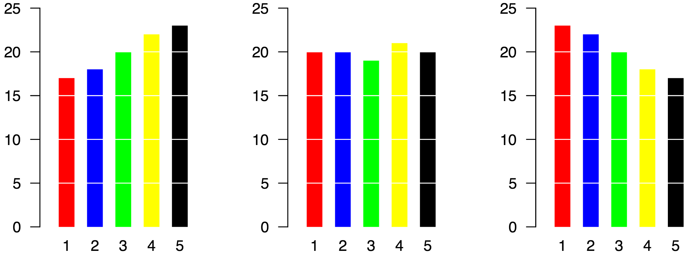

<style>
h1{font-weight: 400;}
</style>

```{r setup, include=FALSE}
knitr::opts_chunk$set(echo = TRUE, message=FALSE, warning = FALSE, eval=TRUE, 
                      fig.width = 16/2, fig.height = 9/2)
library(tidyverse)
library(stringr)
library(knitr)
library(lubridate)
library(forcats)
library(fivethirtyeight)
library(nycflights13)
library(gapminder)
library(babynames)
library(scales)
# devtools::install_github("hadley/emo")
library(emo)
library(moderndive)

# devtools::install_github("thomasp85/patchwork")
library(patchwork)
set.seed(76)
```
<style>
h1{font-weight: 400;}
</style>

***

# Schedule 

* **Topics**:
    1. Tools of the trade (orange): R, RStudio, R packages, R Markdown, Git & GitHub.
    1. Data visualization (pink): Grammar of Graphics, Five Named Graphs (5NG), color theory.
    1. Working with data (blue): Tidy data, data wrangling, data importing. 
    1. Maps and spatial data (green): Map and geospatial data.
    1. Learning how to learn new data science tools (yellow): Text data, webscraping, SQL.
* **Readings + Reference**: MD is ModernDive, MDSR is Modern Data Science with R, TMR is Text Mining with R. 

<iframe src="https://docs.google.com/spreadsheets/d/e/2PACX-1vRvggFhESyu_EFxrcFQXsZtdaQqaqcQ6kgWg173WTkTeWV67RWiZ01G8jhJsQ2b5VUVCJqQ8xo6COWM/pubhtml?gid=1373353942&si  ngle=true&amp;widget=true&amp;headers=false" width="100%" height="810"></iframe>


***


# Lec 12: Wed 10/3 {#Lec12}

## Announcements

* Please vote in Starbucks vs Dunkin Donuts poll in Slack `#polls`.
* ModernDive learning check solutions for Chapter 4 + 5 now posted in Appendix D. 
* PS04 is not due Monday, but Wednesday after the break.
* Discussion on PS03 on Friday.
* Talk on Friday 10/12 5:30pm in Seelye Hall 106. See poster below.
* Project update

<center>
{ width=800px }
</center>  

<br>


## Today's Topics/Activities       

### 1. Discussion on color "chartjunk"

What constitutes "chartjunk"? Look at the following faceted scatterplot of "Median household income" 
and "Number of coffee shops per 1000 people" where we facet by two types of coffee shops: Dunkin Donuts and Starbucks.

<center>
{ width=800px }
</center>

Ask yourself: "In what ways could the color be considered chartjunk?" and "In what ways could the color be useful?" 

The moral of the story: 

> What constitutes "chartjunk" is subjective. You need to make a choice/decision given your audience and own that decision.

Note there is also a blue regression "trend line" that tries to summarize the overall relationship between the points and tell us whether:

* The relationship is positive: as the median income of census tracts goes up, the number of shops in a census tract tends to go up as well. This is the case for Starbucks. **The story the right facet is telling**: This graphical analysis is suggesting Starbucks tend to locate in higher income areas. 
* The relationship is negative: as the median income of census tracts goes up, the number of shops in a census tract tends to go down. This is the case Dunkin Donuts. **The story the left facet is telling**: This graphical analysis is suggesting Dunkin Donuts tend to locate in lower income areas. 


### 2. In-class exercise

Time to work on projects!


***


# Lec 11: Mon 10/1 {#Lec11}

## Announcements

* Notes on Slack:
    + Updated project info in `#general_announcements`
    + Before you ask a question on `#random` or `#r_questions`, see if maybe it's already been answered!
    + Vote on `#polls` on spreadsheets
* Office hours this week. Please Slack me if this disrupts your plans.
    + Monday 10/1: ~~3-6pm~~ 2:30-4:30pm
    + Tuesday 10/2: ~~3-6pm~~ 2-4:30pm
* Problem set 04 to be posted tomorrow morning
* Wednesday's lecture: Class time for projects
    
    
## Today's Topics/Activities       

<center>
{ width=300px }
</center>

### 1. Chalk Talk

* "Tidy" data format. Note "Tidy" here has a specific data science meaning which we are using, and not tidy in the colloquial sense of the word (organized, neat, ...):
{ height=100px }
* See [Wikipedia](https://en.wikipedia.org/wiki/Wide_and_narrow_data){target="_blank"}:
    + "Tidy" = Narrow AKA stacked AKA tall
    + Rectangular data that is not "tidy" = Wide AKA unstacked
* Why do we care about "tidy" data format?
    + Short answer: Because all the functions in the `ggplot2` and `dplyr` R packages for data visualization and data wrangling are *designed* so that all inputs and outputs are in "tidy" format; *this is for consistency*.
    + Longer answer (only if you're curious): Because the `ggplot2` and `dplyr` packages are part of the [`tidyverse`](https://www.tidyverse.org/){target="_blank"}: an opinionated collection of R packages designed for data science. See [tidy tools manifesto](https://cran.r-project.org/web/packages/tidyverse/vignettes/manifesto.html){target="_blank"} for more details (in particular the "Design for humans" section).

### 2. In-class exercise

Read ModernDive from the beginning of Chapter 4 to the end of Chapter 4.3 on "tidy" data format and spreadsheets. Note: we'll come back to Chapter 4.4 on converting "wide" format data to "tidy" data format using the `tidyr` package later in the course.


### 3. Tweet of the day

**Preview of November topics**: We'll be using ["Text Mining in R: A Tidy Approach"](https://www.tidytextmining.com/){target="_blank"} for analyzing text data. Note the word "tidy" in the title:

<blockquote class="twitter-tweet" data-lang="en"><p lang="en" dir="ltr">NEW POST: The Life-Changing Magic of Tidying Text <a href="https://t.co/CUQJZNHsAl">https://t.co/CUQJZNHsAl</a> <a href="https://twitter.com/hashtag/rstats?src=hash&amp;ref_src=twsrc%5Etfw">#rstats</a> <a href="https://t.co/paD965OMoG">pic.twitter.com/paD965OMoG</a></p>&mdash; Julia Silge (@juliasilge) <a href="https://twitter.com/juliasilge/status/726090030653956096?ref_src=twsrc%5Etfw">April 29, 2016</a></blockquote>
<script async src="https://platform.twitter.com/widgets.js" charset="utf-8"></script>


***


# Problem set 4 {#PS04}

*Assigned Tuesday 10/2, due **Wednesday** 10/10 at 9pm Eastern Time*

## 1. DataCamp

No DataCamp this week.

## 2. R component {#PS04_R}

{ width=500px }

Above are the results of the Slack poll in the `#polls` channel from Wed 9/19 on "imposter syndrome". You'll be analyzing this data via barplots

* View the following [PDF of 5 barplots](static/PS/Figures.pdf){target="_blank"}. You will be recreating this barplots in R. 
* Download the following R scratchpad: <a href="static/PS/PS04_lastname_firstname.R" download>`PS04_lastname_firstname.R`</a> and rename it so that it matches your name. For example in my case: `PS04_Kim_Albert.R`.
* Open `PS04_lastname_firstname.R` and follow the indicated steps. I *highly* recommend you copy and paste existing code from ModernDive and then tweak it to achieve your goal.
* When you are finished, check that your code is *reproducible and replicable*.
* **Submission**: Submit this on [Moodle](https://moodle.smith.edu/course/view.php?id=29919){target="_blank"}. 
* See [syllabus](syllabus.html#evaluation-expectations) for expectations on R component submissions.  


***


# Lec 10 {#Lec10}

## Announcements

In preparation for today's lecture, copy/paste all the following code to your `scratchpad.R` on color theory. I'll be covering these examples one-by-one during the chalk talk today.

```{r, eval=FALSE}
# Lec 10 Code:
# Mapping the color aesthetic of scatterplots/barplots to a categorical variable

# Load packages:
library(dplyr)
library(ggplot2)

# 1. Manually create a toy data frame ----
toy_data <- data_frame(
  x = c(1, 2, 3, 4, 5),
  y = c(5, 4, 3, 2, 1),
  count = c(10, 20, 30, 40, 50),
  group = c("A", "B", "C", "D", "E")
)
toy_data

# 2. Scatterplots: mapping group to color aesthetic ----
# 2.a) Simple scatterplot with size set to 5 for all points (i.e. not mapping
# to a variable in toy_data)
ggplot(toy_data, aes(x = x, y = y)) +
  geom_point(size = 5)

# 2.b) Default color scheme: map group variable to color
ggplot(toy_data, aes(x = x, y = y, color = group)) +
  geom_point(size = 5)

# 2.c) Change color palette from default to "Set2": No assumed ordering to group
ggplot(toy_data, aes(x = x, y = y, color = group)) +
  geom_point(size = 5) +
  scale_color_brewer(palette = "Set2")

# 2.d) Change color palette from default to "Blues": Assumed ordering to group
ggplot(toy_data, aes(x = x, y = y, color = group)) +
  geom_point(size = 5) +
  scale_color_brewer(palette = "Blues")

# 3. Barplots: mapping group to fill aesthetic ----
# 3.a) Simple barplot
ggplot(toy_data, aes(x = group, y = count)) +
  geom_col()

# 3.b) color aesthetic is the outline of bars
ggplot(toy_data, aes(x = group, y = count, color = group)) +
  geom_col()

# 3.c) The color of bars corresponds to fill aesthetic
ggplot(toy_data, aes(x = group, y = count, fill = group)) +
  geom_col()

# 3.d) Change color palette from default to "Set2": No assumed ordering to group
ggplot(toy_data, aes(x = group, y = count, fill = group)) +
  geom_col() +
  scale_fill_brewer(palette = "Set1")

# 3.e) Change color palette from default to "YlOrBr": Assumed ordering to group
ggplot(toy_data, aes(x = group, y = count, fill = group)) +
  geom_col() +
  scale_fill_brewer(palette = "YlOrBr")
```

    
    
## Today's Topics/Activities       

### 1. Chalk Talk

**Topic 1**: Default `ggplot` color "palette" for categorical variables (we'll cover color "gradients" for numerical variables later). Notice location of 5 dots on [color wheel](https://stackoverflow.com/questions/21490210/how-to-plot-a-colour-wheel-by-using-ggplot){target="_blank"}.

<center>
{ width=300px}
</center>

**Topic 2**: Changing default color "palette" for categorical variables based on [Prof. Cynthia A. Brewer's](http://www.personal.psu.edu/cab38/){target="_blank"} research on cartography. Click on this link: [Color Brewer 2.0](http://colorbrewer2.org/){target="_blank"}. Note the areas highlighted in red below, in particular the `BuGn` color palette code.

<center>
{ width=600px }
</center>

  
  
  

### 2. In-class exercise

* Class time to work on mini-project 1
* **Start memorizing** Table 3.5 in ModernDive 3.9: Summary of when to use which of the "Five Named Graphs (5NG)"  
<center>
{ width=600px }
</center>


### 3. Tweet of the day

Advice from [\@hadleywickham](http://hadley.nz/){target="_blank"}, creator of the `ggplot2` and `dplyr` R packages:

<blockquote class="twitter-tweet" data-lang="en"><p lang="en" dir="ltr">This is the best advice from <a href="https://twitter.com/hadleywickham?ref_src=twsrc%5Etfw">@hadleywickham</a>. True of learning R. True of learning anything. <a href="https://twitter.com/hashtag/rstats?src=hash&amp;ref_src=twsrc%5Etfw">#rstats</a> <a href="https://t.co/Qh8SuRuBUk">https://t.co/Qh8SuRuBUk</a> <a href="https://t.co/sOeoQQOYye">pic.twitter.com/sOeoQQOYye</a></p>&mdash; Aaron Williams (@awunderground) <a href="https://twitter.com/awunderground/status/1033417868673724418?ref_src=twsrc%5Etfw">August 25, 2018</a></blockquote>
<script async src="https://platform.twitter.com/widgets.js" charset="utf-8"></script>


***


# Lec 9 {#Lec09}

## Announcements

* A reminder that the Data Assistants in our lectures (Jordan and Paige) are also the Sunday thru Thursday 7-9pm McConnell Hall 301 [tutors](https://www.smith.edu/qlc/tutoring.html?colStats=open#PanelStats){target="_blank"}.
* Added to "Event" column in calendar above: Class time to work on mini-project 1:
    + Friday 9/28
    + Wednesday 10/3
* Solutions to PS02 [posted](#PS02_R_solutions). Please download the `PS02_solutions.R` file to your computer and open them in RStudio for a brief in-class discussion.
    + **RStudio Desktop users**: To guarantee the `PS02_solutions.R` file opens in the RStudio app (AKA a car's dashboard) and not the regular R app (AKA a car's engine), don't double-click the `PS02_solutions.R` file directly, but rather go to Files panel of RStudio and find/click/open the file from there.
    + **RStudio Server users**: Download `PS02_solutions.R` to your computer, then upload it to RStudio by clicking "upload" like in this image: 

    
    
## Today's Topics/Activities       

### 1. Mini-Discussion on pie charts

Say the following piecharts represent results of an election poll at time points A = September, B = October, then C = November. At each time point we present the proportion of the poll respondents who say they will support one of 5 candidates: 1 through 5. Based on these 3 piecharts, answer the following questions:

* At time point A, is candidate 5 doing better than candidate 4?
* Did candidate 3 do better at time point B or time point C?
* Who gained more support between time point A and time point B, candidate 2 or candidate 4?

{ width=600px }

Compare that to using barplots. Which do you *prefer*?

{ width=600px }


### 2. Chalk Talk

The trickiest of the Five Named Graphs: Barplots. In particular, whether you use
`geom_bar()` or `geom_col()` to create a barplot depends on whether the sums
are pre-computed.

### 3. In-class exercise

Read ModernDive 3.8 on barplots

### 4. Tweet of the day

Click here for definition of ["Winging it"](https://www.urbandictionary.com/define.php?term=winging%20it){target="_blank"}.

<blockquote class="twitter-tweet" data-lang="en"><p lang="en" dir="ltr">Advice for aspiring data scientists: learn SQL, communication is a technical skill, start a blog, teach others, don&#39;t worry about learning everything, find your community, stay curious, have fun, don&#39;t be afraid to use Google, and remember that everyone is winging it.</p>&mdash; Caitlin Hudon👩🏼
💻 (@beeonaposy) <a href="https://twitter.com/beeonaposy/status/1044426618708643841?ref_src=twsrc%5Etfw">September 25, 2018</a></blockquote>
<script async src="https://platform.twitter.com/widgets.js" charset="utf-8"></script>


***


# Lec 8 {#Lec08}

## Announcements

* Lecture on today will end at 11:55am to give people time to comfortably get to Emily Dodwell's talk listed in [Lec06](#Lec06).
* Visitor: [Data Counselor Raul Zelada Aprili](https://www.smith.edu/qlc/tutoring.html?colDataCnslr=open#PanelDataCnslr){target="_blank"}
* Go over question in `#random`: Most simple, most important, and yet most neglected step in a data analysis, even on my team at Google: just **looking** at your data
* Finishing details of Mini-project 1 in [Projects](term_project.html#miniproj1) tab
* Problem sets:
    + PS02 due tonite at 9pm
    + PS03 posted by tonight at 9pm


## Today's Topics/Activities       

### 1. Chalk Talk

```{r, eval=TRUE, echo=FALSE}
library(ggplot2)
library(dplyr)
example <- data_frame(
  values = c(1, 3, 5, 6, 7, 8, 9, 12, 13, 14, 15, 30)
)
```

(Slightly longer than usual chalk talk): Doing by hand what `geom_boxplot()` automates: drawing a boxplot: say we want to plot a boxplot of the following `r nrow(example)` values which are pre-sorted: 

> `r example %>% pull(values)`

They have the following *summary statistics*. A summary statistic is a single numerical value *summarizing* many values. Examples include the immediately obvious mean AKA average and median. Other less immediately obvious examples include:

* Quartiles (1st, 2nd, and 3rd) that cut up the data into 4 parts, each containing roughly one quarter = 25% of the data
* Minimum & maximum
* Interquartile-range (IQR): the distance between the 3rd and 1st quartiles


Min. | 1st Quartile | Median = 2nd Quartile  | 3rd Quartile  |  Max. | IQR
---- | ------- | ------  |  ------- | --- | ---
`r min(example$values)`  |  `r quantile(example$values, probs=0.25, type = 2)` |  `r median(example$values)`  |  `r quantile(example$values, probs=0.75, type=2)`  | `r max(example$values)` | 8 = 13.5 - 5.5

Let's compare the points and the corresponding boxplot side-by-side with the values on the $y$-axis matching:

```{r, echo=FALSE, eval=TRUE, cache=TRUE}
plot1 <- ggplot(example, aes(x=factor(1), y=values)) +
  geom_point() +
  labs(title = "Points") +
  theme(
    axis.title.x = element_blank(),
    axis.text.x = element_blank(),
    axis.ticks.x = element_blank()
  )

plot2 <- ggplot(example, aes(x=factor(1), y=values)) +
  geom_boxplot() +
  labs(title = "Boxplot") +
  theme(
    axis.title.x = element_blank(),
    axis.text.x = element_blank(),
    axis.ticks.x = element_blank()
  )
plot1 + plot2
```

### 2. In-class exercise

Read ModernDive 3.7 on Boxplots


***


# Problem set 3 {#PS03}

*Assigned Tuesday 9/25, due Monday 10/1 at 9pm Eastern Time*

## 1. DataCamp

* Complete *only* the following two chapters from the "Introduction to the Tidyverse" course, which you should see in the following [link](https://www.datacamp.com/enterprise/2018-09-sds192-intro-to-data-science/assignments){target="_blank"}:
    * Chapter 3: "Grouping and summarizing"
    * Chapter 4: "Types of visualizations"
* See the [syllabus](syllabus.html#evaluation-expectations) for expectations on DataCamp assignments.


## 2. R component {#PS03_R}

Read the following Chance Magazine article [Looking Good on Course Evaluations](http://chance.amstat.org/2013/04/looking-good/){target="_blank"} up to and including Table 1. In particular, note the introductory paragraph:

> At the end of each semester, students provide feedback on their courses via anonymous course evaluations. However, use of student evaluations as indicators of quality of the course and teaching effectiveness is often criticized since these measures may be reflecting biases in favor of nonteaching-related characteristics, such as the physical appearance of the instructor.

You'll be analyzing the same data used in this study. The data is in the `evals` data frame, which is included in the `moderndive` R package. A larger goal of this problem set is to start practicing answering questions with data visualizations

* Download the following R scratchpad: <a href="static/PS/PS03_lastname_firstname.R" download>`PS03_lastname_firstname.R`</a> and rename it so that it matches your name. For example in my case: `PS03_Kim_Albert.R`.
* Open `PS03_lastname_firstname.R` and follow the indicated steps. I *highly* recommend you copy and paste existing code from ModernDive and then tweak it to achieve your goal.
* When you are finished, check that your code is *reproducible and replicable*. Meaning if you were to send someone else this file and they ran the code, would they get the same results as you?
    + Save your work. The filename `PS03_lastname_firstname.R` should change from red to black.
    + Close `PS03_lastname_firstname.R`.
    + Restart R: RStudio menu bar -> Session -> Restart R. This "reboots R" by deleting all previously saved data frames and shuts down all loaded packages.
    + Go to the Files panel of RStudio and re-open `PS03_lastname_firstname.R`.
    + Run all your code as described in [Lec4](#Lec04) and make sure that you can replicate all images.
* **Submission**: Submit this on [Moodle](https://moodle.smith.edu/course/view.php?id=29919){target="_blank"}. 
* See [syllabus](syllabus.html#evaluation-expectations) for expectations on R component submissions.  

**Hints**:

* Everything you need to know for this problem set are based on Lectures 1-8 in particular the ModernDive readings.
* While I encourage you collaborate/help each other out, please make an honest effort to do this problem set. This is practice for the first mini-project!

**RStudio Server users**:

* To "Upload" the `PS03_Kim_Albert.R` file from your computer to RStudio Server so you can work on it: Go to RStudio -> Files panel -> Upload.
* To "Download" the `PS03_Kim_Albert.R` file from RStudio Server to your computer so you can submit it on Moodle: Go to RStudio -> Files panel -> More -> Export.
* See image below


***


# Lec 7 {#Lec07}

## Announcements

* Go over questions in `#random` Slack channel
* ModernDive Learning Check solutions are ~~directly under question statement~~ now all in [Appendix D](https://moderndive.netlify.com/d-appendixd){target="_blank"} at the back of the book.
* Lecture on Monday will end at 11:55am to give people time to comfortably get to Emily Dodwell's talk listed in [Lec06](#Lec06).
* Mini-project 1: Look at "Projects" tab
* **Videoconferencing**: In Slack, in a Direct Message, type `/appear SOME_UNIQUE_NAME_ONLY_YOU_WOULD_THINK_OF`


## Today's Topics/Activities       

### 1. Discussion on Histogram Binning

Comparing Figures 3.10 and 3.11 in the ModernDive readings on histograms:

```{r, eval=FALSE, echo=TRUE}
library(ggplot2)
library(nycflights13)
# Code to generate Fig 3.10 with bar border color white
ggplot(data = weather, mapping = aes(x = temp)) +
  geom_histogram(color = "white")
# Code to generate Fig 3.11
ggplot(data = weather, mapping = aes(x = temp)) +
  geom_histogram(bins = 60, color = "white")
```
```{r, eval=TRUE, echo=FALSE}
# Code to generate Fig 3.10
p1 <- ggplot(data = weather, mapping = aes(x = temp)) +
  geom_histogram(color = "white") +
  labs(title = "Fig 3.10: 30 bins")
# Code to generate Fig 3.11
p2 <- ggplot(data = weather, mapping = aes(x = temp)) +
  geom_histogram(bins = 60, color = "white") +
  labs(title = "Fig 3.11: 60 bins")
p1 + p2
```

Why the weird up and down spikes in the right-hand histogram? Here is a **random** sample of 99 temperatures of the `r weather %>% filter(50 <= temp & temp < 51) %>% nrow()` temperature recordings between 50 and 51 degrees

```{r, echo=FALSE}
set.seed(76)
weather %>% filter(50 <= temp & temp < 51) %>% sample_n(99) %>% pull(temp)
```

Here is a **random** sample of 99 temperatures of the `r weather %>% filter(55 <= temp & temp < 56) %>% nrow()` temperature recordings between 55 and 56 degrees:

```{r, echo=FALSE}
set.seed(76)
weather %>% filter(55 <= temp & temp < 56) %>% sample_n(99) %>% pull(temp)
```

What is the pattern?


### 2. Chalk Talk

Facets and Facetted Histograms. Say you're asking yourself "What kind of jacket (if any) should I bring to my trip to New York?" Which plot is more useful? Fig 3.13 from ModernDive of all `r nrow(weather)` temperature recordings at all three airports in New York City

```{r, eval=TRUE, echo=FALSE}
library(ggplot2)
library(nycflights13)
ggplot(data = weather, mapping = aes(x = temp)) +
  geom_histogram(binwidth = 10, color = "white")
```

to Fig 3.14 of the temperature recordings *split by month*.

```{r, eval=TRUE, echo=FALSE}
ggplot(data = weather, mapping = aes(x = temp)) +
  geom_histogram(binwidth = 5, color = "white") +
  facet_wrap(~ month, nrow = 4)
```


### 3. In-class exercise

Read ModernDive 3.6 on Facets


### 4. Tweet of the day

ModernDive co-author Chester Ismay [\@old_man_chester](https://twitter.com/old_man_chester){target="_blank"} is Senior Curriculum Lead at DataCamp. If you are curious for a "big picture" view of why we are using DataCamp, read the linked blogpost, in particular look at the image of the "data science pipeline". Remember, you have free access to **all** DataCamp courses for 6 months!

<blockquote class="twitter-tweet"><p lang="en" dir="ltr">Read this blog post by <a href="https://twitter.com/old_man_chester?ref_src=twsrc%5Etfw">@old_man_chester</a> to learn about our new Tidyverse Fundamentals with R Skill Track! In this track, you’ll learn the skills needed to get you up and running with data science in R using the <a href="https://twitter.com/hashtag/tidyverse?src=hash&amp;ref_src=twsrc%5Etfw">#tidyverse</a>. <a href="https://t.co/4fqAdJgoTX">https://t.co/4fqAdJgoTX</a> <a href="https://t.co/RsYxe4Hpm5">pic.twitter.com/RsYxe4Hpm5</a></p>&mdash; DataCamp (@DataCamp) <a href="https://twitter.com/DataCamp/status/1042851042139025409?ref_src=twsrc%5Etfw">September 20, 2018</a></blockquote> <script async src="https://platform.twitter.com/widgets.js" charset="utf-8"></script>


***


# Lec 6 {#Lec06}

## Announcements

* Curious about a career in data science? Then come for Emily Dodwell (class of 2011)'s talk "The Nuts and Bolts of a Data Science Career" on Monday 9/24; stay for the `r emo::ji("pizza")`lunch! Click [here](static/dodwell_talk.pdf){target="_blank"} for details.
* Added hints to Problem set 2 R component [below](#PS02_R).
* In above schedule and in [syllabus](syllabus.html#projects) project due dates are posted. Details on mini-project 1 on data visualization will be given this Friday.
* RStudio Server update: [Computing and Technical Services ](http://www.science.smith.edu/cats/){target="_blank"} has added 4 additional processors to RStudio Server so things should run smoother!
* Learning check solutions by Friday, promise!
* Slack poll on `scratchpad.R`


## Today's Topics/Activities       

### 1. Chalk Talk

Histograms visualize the *distribution* of a numerical variable.

### 2. In-class exercise

* Read the following requests from Suzanne Palmer in [Computing and Technical Services ](http://www.science.smith.edu/cats/){target="_blank"} about using RStudio Server
    + "Please do not have students install packages." Recall: If you are using RStudio Server, there is no need to *install* packages, only to *load/open* them using the `library()` command. For example `library(nycflights13)`.
    + "Please ask students to limit their number of concurrent sessions." In other words, when you are done working in RStudio Server, please close your browser window so that it frees up shared computing resources for other people.
    + If you would like to do your own work that involves "big data", for example for a thesis project, please Slack me and we'll set up a separate account.
* Read former Smith College professor [Dr. Amelia McNamara's](https://twitter.com/ameliamn?lang=en){target="_blank"} visual essay on [histograms](https://tinlizzie.org/histograms/){target="_blank"}.
* Then, as marked in the Schedule at the top of this page, read ModernDive 3.5


### 3. Tweet of the day

On *imposter syndrome* is a psychological pattern in which an individual doubts their accomplishments and has a persistent internalized fear of being exposed as a "fraud". Click below to read full thread.

<blockquote class="twitter-tweet" data-lang="en"><p lang="en" dir="ltr">Let&#39;s talk about imposter syndrome in tech -- specifically, ways we can combat it better, both individually and as a community (a thread) 👇</p>&mdash; Caitlin Hudon👩🏼
💻 (@beeonaposy) <a href="https://twitter.com/beeonaposy/status/1042161720771395585?ref_src=twsrc%5Etfw">September 18, 2018</a></blockquote>
<script async src="https://platform.twitter.com/widgets.js" charset="utf-8"></script>


***


# Lec 5

## Announcements

* What my `scratchpad.R` looks like after Lec4. Yours shouldn't be *exactly* the same, but close.  
Note because I saved my work, `scratchpad.R` is written in black. If I had unsaved work, this would be written in red.  
{ width=500px }
* Problem set 02 posted [below](#PS02).

## Today's Topics/Activities       

### 1. Chalk Talk

* What is overplotting?
* When do I use linegraphs instead of scatterplots?

### 2. In-class exercise: Comment lines

In the screen shot of my `scratchpad.R` above, any line that starts with a `#` are called *comment lines*. They are ignored by R when you run them in the console. Run both these lines in the console separately:

```{r, eval=FALSE, echo=TRUE}
this is a comment line that R ignores that helps readers (including you!) understand code

# this is a comment line that R ignores that helps readers (including you!) understand code
```

Why does one line return an `Error` whereas the other doesn't?


### 3. In-class exercise

As marked in the Schedule at the top of this page, read ModernDive 3.3.2 - 3.4 (start of Chapter 3.3.2 to the end of 3.4).


***


# Problem set 2 {#PS02}

*Assigned Monday 9/17, due Monday 9/24 at 9pm Eastern Time*

## 1. DataCamp

* Complete *only* the following two chapters from the "Introduction to the Tidyverse" course, which you should see in the following [link](https://www.datacamp.com/enterprise/2018-09-sds192-intro-to-data-science/assignments){target="_blank"}:
    * Chapter 1: "Data wrangling".
    * Chapter 2: "Data visualization"
    * Skip Chapters 3-4 on "Grouping and summarizing" and "Types of visualizations" for now.
* Note: DataCamp does things in a slightly order, data wrangling first then data visualization. ModernDive however does data visualization first in Chapter 3 then data wrangling in Chapter 5. Reading ModernDive Chapter 5 is not a pre-requisite for completing this problem set.
* See the [syllabus](syllabus.html#evaluation-expectations) for expectations on DataCamp assignments.
* If you have already completed the "Introduction to the Tidyverse" DataCamp course previously using a DataCamp account based on your Smith email, you do not need to re-do them; they will show up in my logs as completed.

## 2. R component {#PS02_R}

Read the following 538 article [Higher Rates Of Hate Crimes Are Tied To Income Inequality](https://fivethirtyeight.com/features/higher-rates-of-hate-crimes-are-tied-to-income-inequality/){target="_blank"}. You'll be analyzing the same data used to write this article. The data is in the `hate_crimes` dataframe, which is included in the `fivethirtyeight` R package. A larger goal of this problem set is to start practicing the "data analysis" workflow.

* Download the following R scratchpad: <a href="static/PS/PS02_lastname_firstname.R" download>`PS02_lastname_firstname.R`</a> and rename it so that it matches your name. For example in my case: `PS02_Kim_Albert.R`.
* RStudio Server users: "Upload" this file to RStudio Server by going to RStudio -> Files panel -> Upload. (see image below)
* Open `PS02_lastname_firstname.R` and follow the indicated steps. I *highly* recommend you copy and paste existing code from ModernDive and then tweak it to achieve your goal.
* When you are finished, check that your code is *reproducible and replicable*. Meaning if you were to send someone else this file and they ran the code, would they get the same results as you?
    + Save your work and close `PS02_lastname_firstname.R`.
    + Restart R: RStudio menu bar -> Session -> Restart R. This "reboots R" by deleting all previously saved data frames and shuts down all loaded packages.
    + Go to the Files panel of RStudio and re-open `PS02_lastname_firstname.R`.
    + Run all your code as described in [Lec4](#Lec04) and make sure that you can replicate the scatterplot.
* **Submission**:
    + RStudio Server users: "Download" this file on to your compter by going to RStudio -> Files panel -> More -> Export. (see image below)
    + Submit this on [Moodle](https://moodle.smith.edu/course/view.php?id=29919){target="_blank"}. 
* See [syllabus](syllabus.html#evaluation-expectations) for expectations on R component submissions.  


**Hints**:

* Everything you need to know for this problem set are based on Lectures 1-4, in particular the ModernDive readings.
* While I encourage you collaborate/help each other out, please make an honest effort to do this problem set. Part of the graders' and my goal in grading the problem sets is to identify both your **strengths and weaknesses** in preparation for the projects. Don't forget the lowest two problem set scores are dropped!


## 3. R component solutions {#PS02_R_solutions}

<a href="static/PS/PS02_solutions.R" download>`PS02_solutions.R`</a>


***


# Lec 4 {#Lec04}

## Announcements

* **Extra office hours today 3:30-5pm in McConnell 215**
* For those of you with interests in Biology: Reed College's Prof Derek Applewhite ["The Spatial and Temporal Regulation of Non-muscle Myosin II Contractility"](https://twitter.com/rudeboybert/status/1040272556991959041){target="_blank"} talk on Monday afternoon.
* Added note about when to do DataCamp courses to [syllabus](syllabus.html#evaluation-expectations): *You do not need to complete any DataCamp courses in preparation for future lectures; they will always be explicitly assigned*.
* Solutions to previous lecture's learning checks will be posted directly underneith question. Ex: Look at [LC2.1 Solutions](https://moderndive.netlify.com/2-getting-started.html#exploredataframes){target="_blank"} I just posted.

## Today's Topics/Activities       

### 1. Chalk Talk

The Grammar of Graphics: the theoretical underpinnings of statistical graphics

### 2. In-class exercise: R code scratchpads

**Question**: Should I be copying/pasting/tweeking code directly in the console window?  
**Answer**: You can, but it makes saving work difficult. Instead, create a "scratchpad":

1. Create a new `.R` script: In RStudio Menu Bar -> File -> New File -> R Script. 
1. Save this as `scratchpad.R`
1. Copy/paste/tweak any code in your scratchpad, not in console window. For example, for this exercise write: `1+1`
1. To "run" code in the console (in other words tell R to "do this"), you can do one of the following:
    1. Copy it from scratchpad, then paste it in console, then hit enter.
    1. Highlight the code you want to run, then click on "Run"
    1. Highlight the code you want to run, then press control+enter on Windows/Unix/Chromebook or ⌘+enter on macOS.

### 3. In-class exercise

As marked in the Schedule at the top of this page, read ModernDive 3 - 3.3.1 (start of Chapter 3 to the end of 3.3.1).

* Do not ignore the "Needed Packages" section at the beginning. Recall:
    + The phone vs app analogy described in ModernDive 2.3.
    + If you are using RStudio Server in your browser, these packages come pre-installed.
    + If you are using RStudio Desktop installed on your computer, you'll have to ensure these packages are installed.
* Please skip the "Introduction to the Tidyverse" DataCamp course mentioned at the beginning of Chapter 3 for now.
* "Learning checks": These are practice problems that you do not need to submit. Should you write your answers down? If you feel like you would benefit, then yes! I will post solutions to the learning checks before the next lecture!


***


# Lec 3

* Go over previous Slack `#general_announcements`
* If you haven't already, **please** complete the [Intro Survey](https://docs.google.com/forms/d/e/1FAIpQLSdTI6UM9OlYygbZQU_gQPtQPGplFIXzmE_YCMPT_1bSkDd3Zw/viewform){target="_blank"} from Lec 1.
* Syllabus discussion:
    + Added full topic schedule
    + Added office hours
    + Added *expectations* to following sections: Basic Course Information, Topic Schedule and Readings, Evaluation, Accommodations, Code of Conduct

## Today's Topics/Activities       
        
1. Go over ModernDive Chapter 2. Note:
    + You can skip all videos and linked DataCamp courses.
    + "Learning checks": These are practice problems that you do not need to submit. Should you write your answers down? If you feel like you would benefit, then yes! I will post solutions to the learning checks before the next lecture!
1. Start Problem set 1 below. I will discuss the DataCamp interface at 11:55am.

## Getting help

A big part of learning data science tools is learning how to get help effectively. For example, in this course:

**In class**:

1. Ask yourself "Is this something I can Google?" Learning to use Google effectively is an important tool in a data scientist's toolbox.
1. Ask the people sitting next to you. 
1. Raise your hand to ask the data assistant or myself.

**Outside of class**:

1. Ask yourself "Is this something I can Google?" Learning to use Google effectively is an important tool in a data scientist's toolbox.
1. Ask yourself "Are there people I work with in class that I can Slack?"
1. If you all don't know, post a question on Slack in the `#r_questions` channel.
1. Visit the Spinelli Center for tutoring Sunday-Thursday 7-9pm (see [syllabus](syllabus.html#basicinfo) for more info).


***


# Problem set 1 {#PS01}

*Assigned Wednesday 9/12, due Monday 9/17 at 9pm Eastern Time*

1. **DataCamp**
    * Complete the following chapters from the "Introduction to R" course, which you should see in the following [link](https://www.datacamp.com/enterprise/2018-09-sds192-intro-to-data-science/assignments){target="_blank"}:
        * Chapter 1: "Intro to basics"
        * Chapter 2: "Vectors"
        * Chapter 4: "Factors"
        * Chapter 5: "Data Frames"
    * See the [syllabus](syllabus.html#evaluation-expectations) for expectations on DataCamp assignments.
    * If you have already completed the "Intro to R" DataCamp course previously using a DataCamp account based on your Smith email, you do not need to re-do them; they will show up in my logs as completed.
1. **Administrative stuff**: To receive full credit for this portion simply ensure
    * On Slack:
        1. Your full name is listed: full name = how you would like to be addressed in class & last name.  
        1. You have added a profile picture with your face visible. This will help me learn your names.
        1. Hint: Start relying on Google! "How do I change my name and profile picture on Slack?"
        1. You are a member of the `#moderndive_typoes`, `#r_questions`, and `random` channels.
    * On DataCamp: Your full name is listed in your [profile](https://www.datacamp.com/profile/account_settings){target="_blank"}; the rest is optional.


***


# Lec 2

1. **Background** Based on n=61 responses so far:  
{ width=600px }
1. **Slack**
    + Click the hashtag in the menu bar to open the SDS 192 Slack team (feel free to use the Slack App if you have it installed). If you have an account yet, click [here](https://join.slack.com/t/2018-fall-sds-albert/shared_invite/enQtNDMzMzMzMTI2NDg2LTM2MmM5OGQ3ZjhjYjQ5MTI5ODk3OTk5YWU2OThjYzdkMWEyYTNjMWIyYTBjNWU1YTE5OTkxZWNkNGFhYjRmZmI){target="_blank"} to join.
    + Practice sending [formated messages](https://get.slack.help/hc/en-us/articles/202288908-Format-your-messages){target="_blank"} to a classmate.
1. **Getting started with data in R**
    + Click "R" in the menu bar above to open RStudio Server to use R in your web-browser.
    + Click on ModernDive above and read Chapter 2: Getting started with data.
        + You don't need to watch the videos for now
        + If you are using RStudio Server, you don't need to install packages. However, you will need to load them.
        + Learning checks: These are practice problems to reinforce your learning. You do not need to submit today's learning checks.
1. **DataCamp** discussion.


## TODO's

1. Make sure you've completed the [Lec 1 TODO's](#Lec1TODO)


***


# Lec 1

1. **Data viz**
    1. [Comparison](http://www.bbc.com/culture/story/20150720-the-london-underground-map-the-design-that-shaped-a-city){target="_blank"} of Beck's original (1933) and today's London Underground map.
    1. [Map](https://deskarati.com/2012/03/31/london-undergrounds-real-map/){target="_blank"} of actual routes London Underground lines follow.
1. **Data wrangling** Do the following...
    1. Login to [RStudio Server](http://rstudio.smith.edu/){target="_blank"}. If you can't, follow along with someone nearby and fill out the help Google Form below.
    1. In the "Console" window copy and paste `library(nycflights13)` and hit enter. Then copy and paste `View(flights)` and hit enter.
1. **Maps and spatial data**
    1. [ColorBrewer 2.0](http://colorbrewer2.org/){target="_blank"}: Color Advice for Maps.
    1. Interactive maps via the [leaflet JavaScript library](https://leafletjs.com/){target="_blank"}, which we'll interface with using the [`leaflet` R package](https://rstudio.github.io/leaflet/){target="_blank"}.
1. **Text data**
    1. Who wrote the New York Times anonymous opinion editorial ["I Am Part of the Resistance Inside the Trump Administration"](https://www.nytimes.com/2018/09/05/opinion/trump-white-house-anonymous-resistance.html){target="_blank"}? A [text analysis approach](http://varianceexplained.org/r/op-ed-text-analysis/){target="_blank"} to answering this question.

## TODO's {#Lec1TODO}

* **Make sure**:
    + You can login to RStudio Server (click R icon in menubar above).
    + You have created a [GitHub](https://github.com/){target="_blank"} account using your Smith email. While I highly encourage you to add a publicly-facing picture and your full name to your profile, this is not required.
    + You are part of the class Slack team (click hashtag icon in menubar above) and 
        1. Have added a profile picture
        1. Can see the ~~`#192_data_science`~~, `#moderndive_typoes`, and `random` channels
        1. Have turned on [email notifications](https://get.slack.help/hc/en-us/articles/201355156-Guide-to-Slack-notifications-#email-notifications){target="_blank"}
    + You have received an invitation email to DataCamp and are a member of the [group](https://www.datacamp.com/enterprise/2018-09-sds192-intro-to-data-science){target="_blank"}. Do not create an account separately on datacamp.com, but rather use the link in the email you received.
    + You've completed the [Intro Survey](https://docs.google.com/forms/d/e/1FAIpQLSdTI6UM9OlYygbZQU_gQPtQPGplFIXzmE_YCMPT_1bSkDd3Zw/viewform){target="_blank"}
* **Need help with any of the above?** ~~Fill out this [Google Form](https://docs.google.com/forms/d/e/1FAIpQLSehdLkV7PPj2_ghaHROdqb4fRCdJDv0ksDLoMw95WpPnfxzqQ/viewform){target="_blank"}~~ Slack me!
